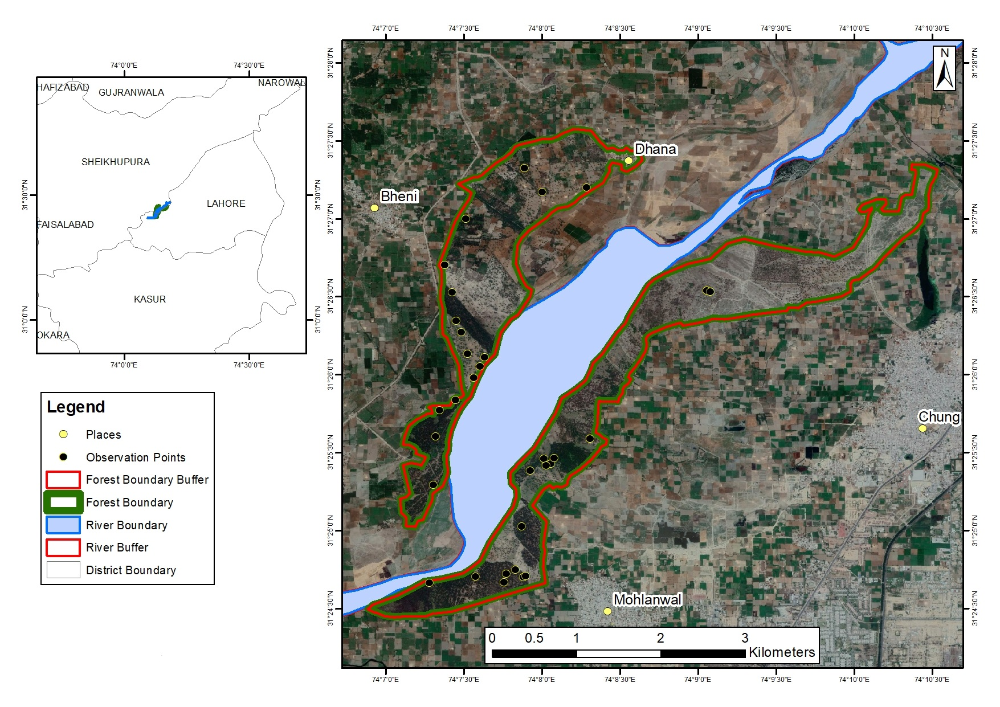

# Asma Mansoor

I am enthusiastic about learning advanced Environmental Informatics and have completed courses on **'Python for Data Science', 'Data Science and Machine Learning', and 'Climate Change and AI'**. I am currently enrolled in **'Full Stack AI with Data Science'**. My educational background is in **Environmental Science**. I work as a visiting faculty member and teach Environmental Science to business and literature students at NUML, Pakistan. My interdisciplinary research background focuses on urban ecology, riparian forestry, communities vulnerable to droughts, floods, and earthquakes, and the social dimensions of environmental issues.

[ResearchGate](https://www.researchgate.net/profile/Asma-Mansoor-3?ev=hdr_xprf)

[LinkedIn](https://www.linkedin.com/in/asma-m-743948124/)

[Email](asmamansoor@numl.edu.pk)

Aiming to work on large datasets, I am highly motivated to contribute to the combination of data science, climate change, and interdisciplinary research. I would be happy to collaborate and learn more about Environmental Data Science.

## My Research Work

  **Jhok Reserve Forest along River Ravi**

## My City Map

<embed type="text/html" src="image/Gcu_map.html" height="650" width="850">

